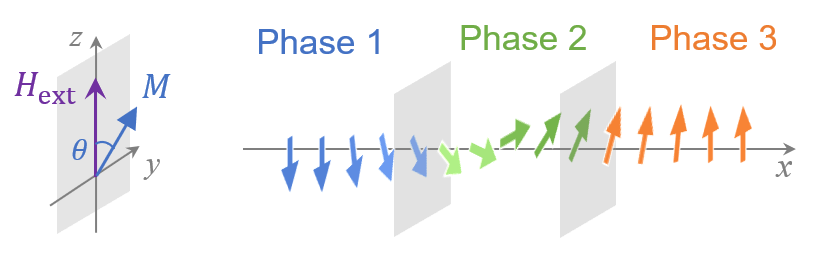

# MAG2305-1D

A finite-differential-method (FDM) simulator specialized in one-dimensional micromagnetics.


## Features

- Pure python scripts (cross platform)
- Specialized for 1D micromagnetics


## Installation

To clone the whole Github repository, or to directly copy the module files in `core/` to your working directory.


## Dependencies

  - [Numpy](https://numpy.org/) (Full dependence, v1.26.0 used by the developer)
  - [Scipy](https://scipy.org/) (Required by SoftHard_module, v1.13.0 used by the developer)
  - [Matplotlib](https://matplotlib.org/) (Optional, for data visualization)


## Why 1D model?

Micromagnetic simulation is a powerful methodology to study the hysteresis phenomenon and microscopic magnetic configurations. Good performance of a micromagnetic simulation requires fineness of simulation settings (such as the discretization of unit cell and the length of time step), sometimes yielding heavy models and prolonged time costs.

It has been shown that within some scenarios, a model formulated in one dimension is good enough for the study. The most famous 1D-micromagnetic model must be the domain wall (DW) structure, either a Bloch-configuration formed in hard magnetic substance, or a Néel-configuration formed in soft phase. 
In the studies of exchange-spring recording media and permanent magnets, the 1D models are also widely implemented. Compared to 3D model, 1D model is no-doubt economic and efficient in computation. Besides, 1D models in some simplified cases are analytically solvable, making benchmarks for calibration of simulation error.

<br>
<div align="center">
    
</div>
<div align="center">
Schematic for 1D model
</div>
<br>

The features of simulation samples created in `MAG2305-1D` include:
1.  The spins form a Bloch-like configuration, varying only along a certain direction, fully described by a function written as $\theta(x)$, with $\theta$ the spin tilting angle and $x$ the position;
2.  The energy of consideration reads:
    $$\mathscr{E} = \sum_{i} \{ K_u^i\sin^2\theta_i - M_s^i H_{ext}\cos\theta_i + A_x^i (\frac{\theta_{i+1} - \theta_{i-1}}{2\Delta})^2 \}, \text{[CGS]}$$
    with $i$ the index of each unit cell, $M_s$ the magnetization saturation, $A_x$ the exchange stiffness constant, $K_u$ the uniaxial anisotropy energy density, and $\Delta$ the cell size;
3.  The time evolution of spin is assumed following the energy descent direction reading:
    $$\dot{\theta_i} = \gamma\alpha [ \frac{2A_x^i}{M_s^i \Delta^2} (\theta_{i+1} + \theta_{i-1} - 2\theta_i) - H_{ext}\sin\theta_i - \frac{2K_u^i}{M_s^i}  \sin\theta_i\cos\theta_i ] ,$$
    with $\gamma$ the gyromagnetic ratio, and $\alpha$ the damping constant.

> Note: at the phase interface, the exchange interaction is replaced with a special form as a consequence of Weierstrass-Erdmann condition.

Here are some examples of what can be done by `MAG2305-1D`:
- DW pinning against / propagation across a phase interface
<div align="center">
    
    
</div>

- Thermally assisted reversal against the interface
<div align="center">
    
</div>


## Quickstart

1.  Import module:

```
# Import core module
import core.MAG2305_1D as MAG
```

2.  Make micromagnetic sample for simulation.

A sample for simulation is created as an `mmSample` class.
The args `cell_size`, `model` and `matters` should be assigned to initialize an `mmSample`.

- `cell_size` *float*: the length [nm] of unit cell

- `model` *numpy array*: the configuration of micromagnetic model, assigning the **matter id** for each unit cell. 
    For example, a micromagnetic model involving 200 unit cells, half of which belongs to matter 1 and 2 respectively, could be made through:
```
# Prepare model configuration
import numpy as np
model = np.empty(200)
model[:100] = 1    # cells   0 - 99 : matter 1
model[100:] = 2    # cells 100 - 199: matter 2
```
> Note: matter id > 0.

- `matters` *numpy array*: to define magnetic parameters for each matter sequentially, formatted as follows:
```
# Prepare matters configuration
# Format : [ [Ms[1], Ax[1], Ku[1]],
#            [Ms[2], Ax[2], Ku[2]],
#            [Ms[3], Ax[3], Ku[3]],
#            ... ]
#
# Ms [emu/cc] : saturation magnetization
# Ax [erg/cm] : exchange stiffness constant
# Ku [erg/cc] : uniaxial anisotropy energy density
#
# Note that the 'matters' start from id 1 !!!
```
An example of `matters` for above `model` could be created as:
```
# matter 1 : Ms=1000 emu/cc, Ax=1.0e-6 erg/cm, Ku=0.0 erg/cc
# matter 2 : Ms=1000 emu/cc, Ax=1.0e-6 erg/cm, Ku=1.0e6 erg/cc
matters = np.array([ [1000, 1.0e-6, 0.0], 
                     [1000, 1.0e-6, 1.0e6] ])
```
   Thereafter, a micromagnetic sample could be created as follows:
```
# Make an mmSmaple called 'sample0'
cell_size = 1.0
sample0 = MAG.mmSample(cell_size=cell_size, model=model, matters=matters)
```

3.  Spin evolution.

Spin configuration for an `mmSample` is represented as an attribute called `Theta`, which records the angle $\theta$ of magnetization tilting for each unit cell. It could be initialized through the following:
```
# Initialize spin state with all theta angle ~ 0.0
spin0 = np.zeros_like(model) + 0.01  # slightly tiltled from 0 to avoid singularity
sample0.SpinInit(Spin_in = spin0)
```
Thereafter, spin evolution can be simulated via a method called `SpinDescent`:
```
# Simulate spin evolution
# -- External field, Hext = -450 [Oe]
# -- Psudo time step, dtime = 1.0e-12 [s]
# The maximal spin change is returned as 'error'
error = sample0.SpinDescent(Hext=-450, dtime=1.0e-12)
```
The above realizes a one-step spin evolution. To approach the stable state under certain external field, an iteration of spin evolution is required as follows:
```
# Find stable state when Hext = -450 Oe
# -- Stop iteration when error <= 1.0e-7
# -- Stop if loops > 100000 (to avoid endless loop)
errlim  = 1.0e-7
itermax = 100000
for n in range(itermax):
    error = sample0.SpinDescent(Hext=-450, dtime=1.0e-12)
    print("error : {}".format(error))
    if error < errlim:
        break
```
One can plot the stable state for visualization. (Make sure `matplotlib` installed).
```
import matplotlib.pyplot as plt
x = np.arange(len(model)) * cell_size
y = np.cos(sample0.Theta)
plt.plot(x, y)
plt.xlabel("position [nm]", fontsize=15)
plt.ylabel(r"cos $\theta$", fontsize=15)
plt.show()
```
The spin configuration will be illustrated as follows:
<div align="center">
    
</div>
<div align="center">
Pinned domain wall as stable state
</div>
<br>

Coercivity in this example is about 500 Oe, which is larger than the external field of 450 Oe, thus resulting in a domain wall pinned against the interface.
